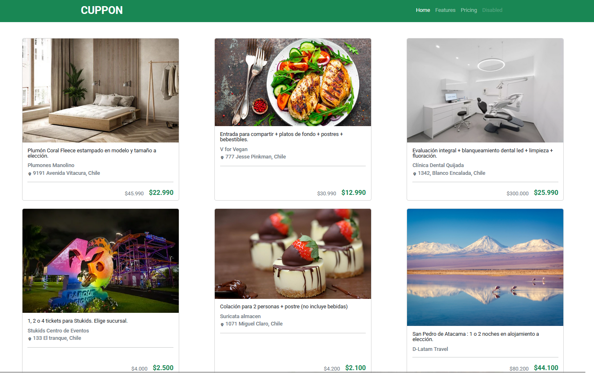
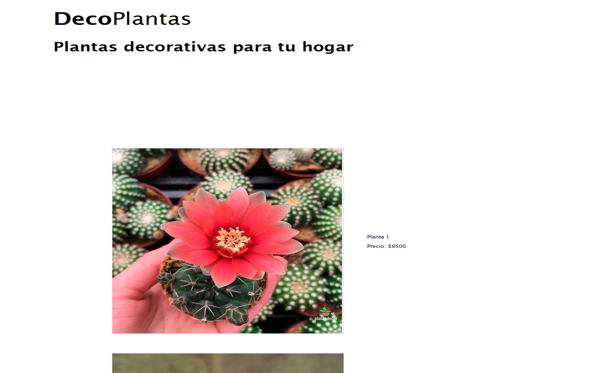
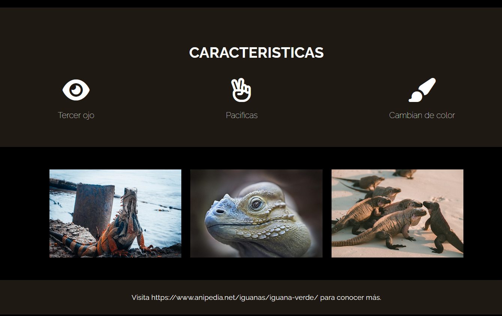
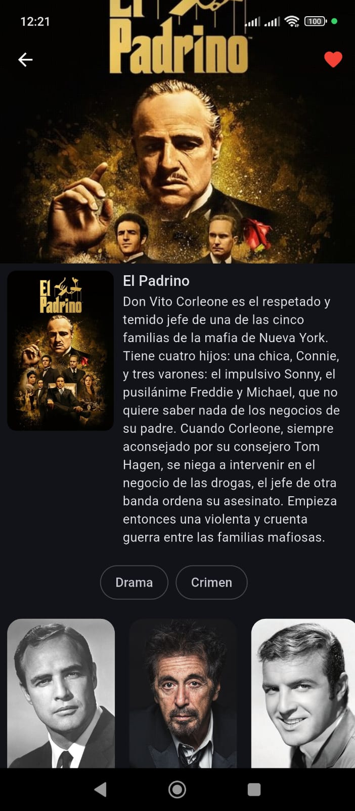

# 📌 Muestra de portafolio y skills

En este repositorio voy a dejar posteados mis mejores proyectos y podran ver mi CV.
Confirmar skills y experiencia.

## 🧠 Descripción

### Dentro de mis proyectos va a encontrar 2 grandes tipos de proyectos:

- Paginas web para demostrar habilidades de contruccion de las mismas.
- Aplicaciones android donde tendran el link descargar el archivo instalador.

## 🚀 Links de aplicaciones android

Estos links se recomienda sean abiertos en un dispositivo android.

### 📋 Links de proyectos forkeados y editados para DesafioLata,

- https://github.com/TrejosD/cafeteria_page
- https://github.com/TrejosD/cuppon_colaborate

### Imagenes de proyectos

